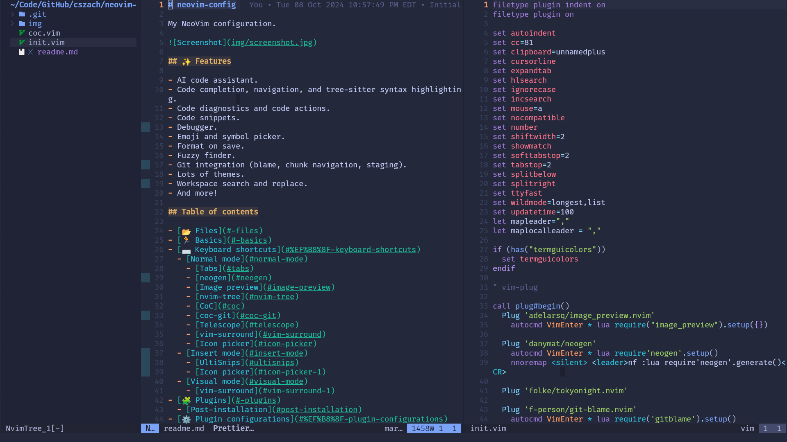

# neovim-config

My NeoVim configuration.



## ✨ Features

- AI code assistant.
- Code completion, navigation, and tree-sitter syntax highlighting.
- Code diagnostics and code actions.
- Code snippets.
- Debugger.
- Emoji and symbol picker.
- Format on save.
- Fuzzy finder.
- Git integration (blame, chunk navigation, staging).
- Lots of themes.
- Workspace search and replace.
- And more!

## Table of contents

- [📂 Files](#-files)
- [🏃 Basics](#-basics)
- [⌨️ Keyboard shortcuts](#%EF%B8%8F-keyboard-shortcuts)
  - [Normal mode](#normal-mode)
    - [Tabs](#tabs)
    - [neogen](#neogen)
    - [Image preview](#image-preview)
    - [nvim-tree](#nvim-tree)
    - [CoC](#coc)
    - [coc-git](#coc-git)
    - [Telescope](#telescope)
    - [vim-surround](#vim-surround)
    - [Icon picker](#icon-picker)
  - [Insert mode](#insert-mode)
    - [UltiSnips](#ultisnips)
    - [Icon picker](#icon-picker-1)
  - [Visual mode](#visual-mode)
    - [vim-surround](#vim-surround-1)
- [🧩 Plugins](#-plugins)
  - [Post-installation](#post-installation)
- [⚙️ Plugin configurations](#%EF%B8%8F-plugin-configurations)
  - [Startify](#startify)
  - [CoC](#coc-1)
- [🪖 CoC plugins](#-coc-plugins)

## 📂 Files

- `init.vim` is the main configuration file.
- `coc.vim` configures keybindings for [CoC][coc] (Conqueror of Completion).

[coc]: https://github.com/neoclide/coc.nvim

## 🏃 Basics

- Tabs are 2 in width and expand to space characters.
  - However, supported files will be formatted with configured formatters.
- There is a colored column at the 81st column. Helpful for limiting line
  length.
- Other than that, mostly stuff you'd expect (auto indent, show line numbers,
  show matching parens, etc).
- Plugins are managed with [vim-plug][vim-plug].
- Theme: `tokyonight-storm` from [tokyonight.nvim][tokyonight.nvim].
- **The leader key is comma (`,`).**

[vim-plug]: https://github.com/junegunn/vim-plug

## ⌨️ Keyboard shortcuts

> [!NOTE]
> The `<leader>` key is set to comma (`,`) in `init.vim`.

### Normal mode

| Shortcut | Description              |
| :------: | :----------------------- |
| `:noa w` | Save without formatting. |
| `<C-l>`  | `:nohl`.                 |

#### Tabs

|  Shortcut   | Description         |
| :---------: | :------------------ |
|  `<C-w>t`   | New tab.            |
| `<C-Left>`  | Go to previous tab. |
| `<C-Right>` | Go to next tab.     |

#### neogen

|   Shortcut   | Description                                  |
| :----------: | :------------------------------------------- |
| `<leader>nf` | Generate annotation for symbol under cursor. |

#### Image preview

Works on [nvim-tree][nvim-tree.lua].

|  Shortcut   | Description    |
| :---------: | :------------- |
| `<leader>p` | Preview image. |

#### nvim-tree

| Shortcut | Description                                       |
| :------: | :------------------------------------------------ |
| `<C-n>`  | Open [nvim-tree][nvim-tree.lua].                  |
| `<C-t>`  | Toggle nvim-tree.                                 |
| `<C-f>`  | Show opened file in nvim-tree.                    |
| `<C-]>`  | Set current folder as root folder.                |
|  `<CR>`  | Open file/folder.                                 |
|   `a`    | Create file (or directory if name ends with `/`). |
| `<C-r>`  | Rename.                                           |
|   `c`    | Copy.                                             |
|   `x`    | Cut.                                              |
|   `p`    | Paste.                                            |
|   `d`    | Delete.                                           |
|   `-`    | Go to parent directory.                           |
|   `y`    | Copy name.                                        |
|   `Y`    | Copy relative path.                               |
|   `gy`   | Copy absolute path.                               |
|   `R`    | Refresh.                                          |

More shortcuts can be found in `:h nvim-tree-mappings-default`.

#### CoC

|   Shortcut   | Description                                        |
| :----------: | :------------------------------------------------- |
|     `[g`     | Go to previous warning/error.                      |
|     `]g`     | Go to next warning/error.                          |
|     `gd`     | Go to the hovered symbol's definition.             |
|     `gy`     | Go to the symbol's type definition.                |
|     `gi`     | Go to the symbol's implementation.                 |
|     `gr`     | Show the symbol's references.                      |
|     `K`      | Show documentation of the symbol under the cursor. |
| `<leader>rn` | Rename symbol.                                     |
| `<leader>ac` | Apply/show code actions at the cursor.             |
| `<leader>as` | Apply/show code actions for the whole file.        |
|  `<space>a`  | Show diagnostics.                                  |
|  `<space>e`  | Show installed CoC extensions.                     |
|  `<space>c`  | Show CoC commands.                                 |
|  `<space>o`  | Show the current file's outline.                   |
|  `<space>s`  | Search workspace symbols.                          |

More shortcuts can be found in [`coc.vim`](coc.vim).

#### coc-git

| Shortcut | Description                            |
| :------: | :------------------------------------- |
|   `[h`   | Go to previous git chunk.              |
|   `]h`   | Go to next git chunk.                  |
|   `[c`   | Go to previous git merge conflict.     |
|   `]c`   | Go to next git merge conflict.         |
|   `gs`   | Show info for the current git chunk.   |
|   `gc`   | Show commit info for the current line. |

Text objects `ig` and `ag` select inside/around the current git chunk (usable
in visual and operator-pending modes).

#### Telescope

|   Shortcut   | Description                               |
| :----------: | :---------------------------------------- |
| `<leader>ff` | Find files.                               |
| `<leader>fg` | Workspace grep (respecting `.gitignore`). |
| `<leader>fb` | Find buffers.                             |
| `<leader>fh` | Find help tags.                           |

#### vim-surround

| Shortcut | Description                                                   |
| :------: | :------------------------------------------------------------ |
| `ysiw"`  | Surround with double quotes (works with any character).       |
|  `cs'"`  | Replace single quotes with double (works with any character). |
|  `ds"`   | Delete surrounding quotes (works with any character).         |

#### Icon picker

|      Shortcut       | Description                               |
| :-----------------: | :---------------------------------------- |
| `<leader><leader>i` | Browse icons and insert the selected one. |
| `<leader><leader>y` | Browse icons and yank the selected one.   |

### Insert mode

#### UltiSnips

| Shortcut | Description                               |
| :------: | :---------------------------------------- |
| `<Tab>`  | Expand snippet or jump to the next field. |
| `<C-b>`  | Jump to the next field.                   |
| `<C-z>`  | Jump to the previous field.               |

#### Icon picker

| Shortcut | Description                               |
| :------: | :---------------------------------------- |
| `<C-i>`  | Browse icons and insert the selected one. |

### Visual mode

|  Shortcut   | Description                                |
| :---------: | :----------------------------------------- |
| `<leader>f` | Format the selection using CoC.            |
| `<leader>a` | Apply/show code actions for the selection. |

#### vim-surround

| Shortcut | Description                                                       |
| :------: | :---------------------------------------------------------------- |
|   `S"`   | Surround selection with double quotes (works with any character). |

## 🧩 Plugins

- [**image_preview.nvim**][image_preview.nvim]: Image Preview for Neovim
- [**neogen**][neogen]: A better annotation generator. Supports multiple
  languages and annotation conventions.
- [**tokyonight.nvim**][tokyonight.nvim]: A clean, dark Neovim theme. The
  currently active colorscheme.
- [**git-blame.nvim**][git-blame.nvim]: Shows git blame information for the
  current line as virtual text.
- [**copilot.vim**][copilot.vim]: GitHub Copilot for AI code completion.
- [**vim-snippets**][vim-snippets]: Snippets for various languages.
- [**onedark**][onedark.vim]: One Dark theme for NeoVim (although I am not
  currently using it).
- [**grug-far.nvim**][grug-far.nvim]: Workspace-wide find and replace in a
  dedicated buffer UI.
- [**nvim-dap**][nvim-dap]: Debug Adapter Protocol client for debugging various
  languages.
- [**vim-startify**][vim-startify]: A fancy start screen for NeoVim.
- [**coc.nvim**][coc]: Conqueror of Completion for code completion and LSP-based
  code navigation.
- [**nvim-colorizer.lua**][nvim-colorizer]: Colorize hex codes in files.
- [**plenary.nvim**][plenary.nvim]: A dependency of
  [telescope.nvim][telescope.nvim].
- [**telescope.nvim**][telescope.nvim]: A fuzzy finder for files, buffers, code,
  help tags, and more.
- [**nvim-tree**][nvim-tree.lua]: A file explorer tree for neovim written in lua
- [**nvim-web-devicons**][nvim-web-devicons]: lua fork of `vim-web-devicons` for
  neovim
- [**nvim-treesitter**][nvim-treesitter]: Treesitter for better syntax
  highlighting.
- [**nerdcommenter**][nerdcommenter]: A plugin for commenting code.
- [**vim-wasm**][vim-wasm]: Syntax highlighting for WebAssembly.
- [**ultisnips**][ultisnips]: Snippet engine, goes with
  [vim-snippets][vim-snippets].
- [**base16.nvim**][base16.nvim]: Provides a lot of Base16 themes.
- [**dressing.nvim**][dressing.nvim]: Improves default vim.ui interfaces.
- [**vim-fugitive**][vim-fugitive]: A Git wrapper so awesome, it should be
  illegal
- [**vim-surround**][vim-surround]: Delete/change/add
  parentheses/quotes/XML-tags/much more with ease.
- [**vim-airline**][vim-airline]: A status line for NeoVim.
- [**vim-airline-themes**][vim-airline-themes]: Themes for
  [vim-airline][vim-airline].
- [**vim-wakatime**][vim-wakatime]: [WakaTime][wakatime] plugin for tracking
  time spent in NeoVim.
- [**transparent.nvim**][transparent.nvim]: Makes NeoVim transparent e.g. so
  the terminal wallpaper may be visible (although I am not currently using
  it).
- [**icon-picker.nvim**][icon-picker.nvim]: Browse and insert icons, symbols,
  and emojis.

[image_preview.nvim]: https://github.com/adelarsq/image_preview.nvim
[neogen]: https://github.com/danymat/neogen
[tokyonight.nvim]: https://github.com/folke/tokyonight.nvim
[git-blame.nvim]: https://github.com/f-person/git-blame.nvim
[copilot.vim]: https://github.com/github/copilot.vim
[vim-snippets]: https://github.com/honza/vim-snippets
[onedark.vim]: https://github.com/joshdick/onedark.vim
[grug-far.nvim]: https://github.com/MagicDuck/grug-far.nvim
[nvim-dap]: https://github.com/mfussenegger/nvim-dap
[vim-startify]: https://github.com/mhinz/vim-startify
[coc]: https://github.com/neoclide/coc.nvim
[nvim-colorizer]: https://github.com/norcalli/nvim-colorizer.lua
[plenary.nvim]: https://github.com/nvim-lua/plenary.nvim
[telescope.nvim]: https://github.com/nvim-telescope/telescope.nvim
[nvim-tree.lua]: https://github.com/nvim-tree/nvim-tree.lua
[nvim-web-devicons]: https://github.com/nvim-tree/nvim-web-devicons
[nvim-treesitter]: https://github.com/nvim-treesitter/nvim-treesitter
[nerdcommenter]: https://github.com/preservim/nerdcommenter
[vim-wasm]: https://github.com/rhysd/vim-wasm
[ultisnips]: https://github.com/SirVer/ultisnips
[base16.nvim]: https://github.com/Soares/base16.nvim
[dressing.nvim]: https://github.com/stevearc/dressing.nvim
[vim-fugitive]: https://github.com/tpope/vim-fugitive
[vim-surround]: https://github.com/tpope/vim-surround
[vim-airline]: https://github.com/vim-airline/vim-airline
[vim-airline-themes]: https://github.com/vim-airline/vim-airline-themes
[vim-wakatime]: https://github.com/wakatime/vim-wakatime
[wakatime]: https://wakatime.com
[transparent.nvim]: https://github.com/xiyaowong/transparent.nvim
[icon-picker.nvim]: https://github.com/ziontee113/icon-picker.nvim

### Post-installation

The following plugins require setting up after installation:

- copilot.vim: `:Copilot setup`
- vim-wakatime: `:WakaTimeApiKey`

## ⚙️ Plugin configurations

### Startify


[Startify][vim-startify] will display the text `NVIM` in large isometric letters
using ASCII and a random cowsay message. Requires `figlet` and `cowsay` to be
installed.

### CoC

Most of the configuration for CoC is in `coc.vim`, which sets a lot of the
[keyboard shortcuts](#-keyboard-shortcuts).

Below is my `CocConfig`:

```json
{
  "rust-analyzer.check.command": "clippy",
  "coc.preferences.formatOnSave": true
}
```

## 🪖 CoC plugins

CoC plugins enable syntax highlighting, inlay hints, code completion, code
formatting, and more.

The CoC plugins that I have installed as of this commit are:

- coc-tailwindcss
- coc-sonarlint
- coc-prettier
- coc-marketplace
- coc-html
- coc-git
- coc-tsserver
- coc-toml
- coc-rust-analyzer
- coc-json
- coc-java
- coc-glslx
- coc-css
- coc-clangd

Browsing and installing more plugins can be done with `:CocList marketplace`,
but coc-marketplace must be installed first:

```
:CocInstall coc-marketplace
```
